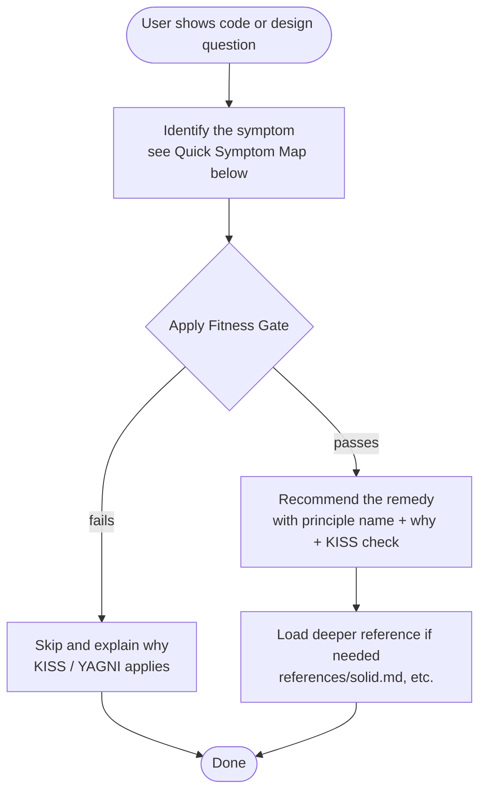
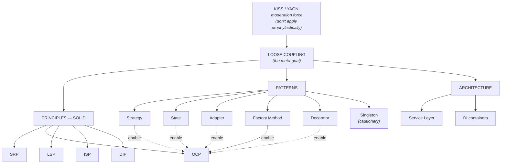

# SOLID, Patterns & Decoupling — When To Apply What

## Overview

This skill helps you **decide when to apply** SOLID principles, design patterns, and decoupling techniques — and just as importantly, **when NOT to**.

**Core stance: KISS overrides cleverness.** Most design failures come from applying patterns/principles **prophylactically** for hypothetical futures. Every recommendation must pass a fitness gate before it's offered.

**The unifying meta-goal of all techniques in this skill is loose coupling.** SOLID, design patterns, and architectural patterns are different lenses on the same target.

## When to invoke this skill

- Designing a new class, module, interface, or service.
- Refactoring existing code that has grown awkward.
- Reviewing code for OOP design quality.
- Deciding between inheritance and composition.
- Choosing whether a specific design pattern fits.
- Evaluating whether code has the right abstractions, or too many.
- A user asks "is this design good?" / "should I use pattern X?" / "how do I clean this up?"

## When NOT to invoke this skill

- Throwaway scripts, one-shot data munging, simple CLI utilities.
- Greenfield prototyping where you're still discovering requirements.
- Fixing typos, formatting, simple bug fixes that don't touch design.
- Code in a paradigm where SOLID barely applies (pure functional, declarative DSLs).
- **Narrow questions about specific code** (e.g., "should I rename this method?", "what does this function do?", "fix this off-by-one"). Don't activate the full framework for a one-line answer.
- Questions about language syntax, library usage, or tool configuration that aren't about design.

## The Fitness Gate (run BEFORE any recommendation)

### Primary gate (the one falsifiable question)

> **"What would change in the user's code if I did NOT recommend this?"**

This is the single most important check in the whole skill. Answer it honestly and concretely:
- *"They'd be unable to add the Slack notifier next sprint without editing the dispatch logic"* → recommendation justified.
- *"They'd have a slightly less elegant class hierarchy"* → ceremony. Skip it.
- *"It'd be harder to swap implementations someday"* → too vague. **Name the specific implementation that's already on the table** or skip it.

If you cannot name a **concrete, named, present-day or near-term scenario** that breaks without your recommendation, the recommendation is ceremony. Skip it.

### Pre-pattern checks (apply BEFORE pulling out a GoF pattern)

1. **Does the standard library or language already solve this?** (e.g., Python's `logging` module replaces a Logging Decorator; first-class functions replace a Strategy class hierarchy; `dict[str, callable]` is already a Strategy.) **If stdlib/language solves it, prefer that.**
2. **What is the language-idiomatic form?** GoF patterns assume Java/C# class hierarchies. In Python a `Protocol` + dict is often the whole answer. In Go, an interface and a map. In Rust, a trait. Don't recommend a `StrategyContext` wrapper class in a language that doesn't need one.
3. **Are you about to suggest a class for something a function would handle?** If yes, suggest the function.

### Supporting questions (sanity checks, not gates)

- Will the abstraction make the code **easier to reason about** for a maintainer?
- Is there at least **one specific present-day scenario** that needs it?
- Is the cost of being wrong low and the benefit real?

If the primary gate fails, don't bother with these. If the primary gate passes but the supporting questions fail, sharpen your recommendation (smaller intervention) instead of recommending nothing.

See `references/kiss-yagni.md` for the full moderation stance.

## How to use this skill

## Quick Symptom Map

If the symptom isn't here, see `references/symptom-map.md` for the extended version.

| Symptom in code | Likely remedy | Principle / Pattern |
|-----------------|---------------|---------------------|
| `if/elseif` chain on a type code or string | Strategy pattern (or polymorphism) | OCP |
| `switch (status)` repeated across many methods | State pattern | OCP + SRP |
| Class touches multiple stakeholder concerns (finance + ops + eng) | SRP split | SRP |
| Class name has "And" or vague suffix (Manager, Helper, Processor) | SRP split | SRP |
| Subclass throws "not supported" / no-ops parent methods | Split the interface | ISP |
| Subclass override changes return type or breaks parent's contract | Fix hierarchy or use composition | LSP |
| Constructor body contains `new ConcreteX()` for dependencies | Dependency Injection (constructor injection) | DIP |
| Conditional construction (`if config then new A() else new B()`) scattered | Factory Method | OCP + SRP |
| Combinatorial subclass explosion (`EmailAndSMSAndSlack...`) | Decorator pattern | OCP, composition over inheritance |
| Wrapping every call to a 3rd-party API with shape conversion | Adapter pattern | SRP + OCP |
| "We need exactly one of X" + considering global access | **Try DI first.** Singleton is last resort. | DIP > Singleton |
| Controllers contain business logic | Service Layer | SoC, layered architecture |
| Same code copy-pasted that serves DIFFERENT stakeholders (heuristic: *who files the bug when this needs to change?* If different teams/roles → different stakeholders) | **LEAVE IT** — DRY is wrong here | SRP overrides DRY |
| Premature interface with one implementation, forever | **Inline it** | YAGNI violation |

## How to phrase a recommendation

When recommending a principle or pattern, **always include**:

1. **The specific symptom** you saw (quote the code).
2. **Why it predicts a problem** (what would go wrong if left alone — answer "what would change if we did NOT do this?").
3. **The principle or pattern name** (Strategy, SRP, Decorator, etc.).
4. **The concrete refactor** in the user's language (use idiomatic forms — `Protocol` in Python, interface in Go, etc.).
5. **The KISS check** ("if you only have 2 stable variants, the conditional is fine").
6. **A link to the deeper reference** if the user wants more.

### Worked example: a recommendation that PASSES the gate

> "I see an `if/elseif` chain on `payment_type` in `process()` (line 47). You mentioned crypto support is on the roadmap and the team has already added 2 payment types this quarter. Adding crypto currently requires editing this method (OCP violation), and you'd repeat that pain for every future type. Consider extracting each branch into a class implementing a `PaymentProcessor` protocol (Strategy pattern). In Python that's a `Protocol` + a dict — no need for a `StrategyContext` wrapper. KISS check: if these 3 types were stable forever, the conditional would be fine. They're not, so the extraction is justified now. Details: `references/patterns.md#strategy-behavioral`."

### Worked example: a recommendation that FAILS the gate (what to say instead)

> "I notice `Order.total()` calculates tax inline. You could extract a `TaxCalculator` interface for flexibility, but **let me run the gate first**: what would change if we didn't? You said this app sells one product type to one country with one tax rate. Nothing would change. The TaxCalculator interface would be ceremony — a class with one implementation, forever, that adds indirection without benefit. **My recommendation: leave it inline.** If you ever expand to multiple jurisdictions, that's the trigger to revisit. I'd add a one-line comment marking the tax math so it's findable when that day comes."

The second example is just as valuable as the first. Half the value of this skill is **declining to recommend things**.

## Sequencing recommendations in a code review

When you have multiple findings, present them in this order:

1. **Security / data-loss issues** (hardcoded secrets, SQL injection, missing validation). These are not design issues — fix immediately, regardless of patterns.
2. **Correctness bugs** (logic errors, race conditions, dead code). Same — fix first.
3. **Structural changes that have concrete present-day pressure** (the patterns/principles this skill covers, when the Fitness Gate passes).
4. **Polish** (naming, comments, minor consistency).
5. **Things you're explicitly NOT recommending** (with brief reasoning, so the user knows you considered them and rejected them).

Don't bury a security issue under a Strategy-pattern lecture. Don't propose patterns for problems you haven't yet established are real.

## The Conceptual Map

- **SRP** and **DIP** are the most universally applied (community consensus).
- **OCP** is the design goal; most patterns achieve it.
- **LSP** constrains how inheritance can satisfy OCP.
- **ISP** is "SRP for interfaces"; supports DIP.
- **Composition over inheritance** is the modern default.

## Common Mistakes (and how to spot yourself making them)

| Mistake | Reality | Fix |
|---------|---------|-----|
| "We might need this someday." | YAGNI violation. | Don't build it. Add a TODO. |
| "Pattern X would be cleaner." | "Cleaner" without a concrete pain point = ceremony. | Name the present-day pain. If you can't, skip the pattern. |
| Wrapping everything in interfaces "for testability" | Often un-mockable singletons or trivial value objects don't need interfaces. | Apply DIP only where you'd actually swap implementations. |
| Recommending Singleton for shared state | Refactoring.Guru's own page warns against it: violates SRP, hard to test, hides dependencies. | Use DI. Singleton only if DI is genuinely impossible. |
| DRY'ing code that serves different stakeholders | SRP overrides DRY. Same-looking code for different actors will diverge. | Leave it duplicated. Document why. |
| Inheritance for "code reuse" | Tightly couples and breaks LSP often. | Composition + interface. |
| Extracting a Service Layer for a 3-endpoint app | Over-engineering. | Call domain methods directly. |
| Premature Factory Method when there's only one product type | Pattern is overkill. | Use the constructor. |
| Treating SOLID as inviolable laws | They are heuristics. **Known DIP exception**: logging — loggers are typically used as globals/statics across a codebase because logging is a cross-cutting platform concern (not domain logic). Forcing every class to receive a `Logger` via DI buys little and clutters every constructor. Use stdlib logging conventions; reserve DI for domain dependencies. | Be pragmatic. Note exceptions explicitly. |
| Recommending pattern without specifying when NOT to use it | Half the value of a pattern is knowing its limits. | Always include the KISS check. |

## Red Flags (stop and reconsider)

You're about to recommend something problematic if you find yourself thinking:
- "This is more enterprise-grade." → ceremony alarm
- "This makes it more flexible." → for what concrete scenario?
- "We should add a layer of indirection." → which existing pain does it relieve?
- "Let's add an interface in case we need another implementation." → YAGNI
- "This is what the textbook says to do." → does the textbook know your codebase?
- "I'll add the abstract base class so subclasses can override later." → wait until the second subclass exists

When you see yourself thinking any of these, **run the Fitness Gate again**.

## When to load a reference file

- **`references/solid.md`** — when a SOLID principle needs deeper explanation, or you need to discuss interactions between principles, or the user asks "what is X?" about SRP/OCP/LSP/ISP/DIP.
- **`references/patterns.md`** — when recommending a specific pattern and the user wants the structure / pros / cons / alternatives, or you need to disambiguate similar patterns (Strategy vs State, Adapter vs Decorator).
- **`references/decoupling.md`** — when discussing loose coupling at architecture scale, the decoupling toolkit (DI, events, queues), or the Service Layer pattern.
- **`references/kiss-yagni.md`** — when you need to defend a "don't add this" recommendation, or the user pushes back on simplicity.
- **`references/symptom-map.md`** — when the Quick Symptom Map above doesn't match the user's situation precisely, or you need anti-pattern detection.

## High-leverage one-liners (use these in conversations)

- **"Most design patterns are ways of organizing code so OCP is followed."** — frames patterns as a means, not an end.
- **"It's impossible to make a completely closed program. What you can choose is what to close and what to leave open."** — defends pragmatic OCP application.
- **"Depend on things that change less often than you do."** — explains DIP intuitively.
- **"Decorator changes the skin, Strategy changes the guts."** — disambiguates two structurally-similar patterns.
- **"Inheritance is almost always a bad idea. Composition and interfaces is a much better way to go."** — the modern OOP consensus.
- **"SRP is about people, not code."** — explains why "reason to change" means "stakeholder."
- **"Perfection is reached not when there is nothing left to add, but when there is nothing left to take away."** — Saint-Exupéry, the KISS spirit.

## What this skill does NOT cover

- Patterns outside the 6 covered: Builder, Abstract Factory, Prototype, Bridge, Composite, Facade, Flyweight, Proxy, Chain of Responsibility, Command, Iterator, Mediator, Memento, Observer, Template Method, Visitor. These exist in the GoF catalog and Refactoring.Guru. If a problem clearly maps to one (e.g., complex object assembly → Builder), recommend it but say the skill doesn't cover it in depth.
- Functional programming patterns (monads, lenses, transducers, etc.).
- Concurrency patterns (Actor, Producer/Consumer, etc.).
- Distributed systems patterns beyond loose-coupling basics.
- DDD tactical patterns (Aggregates, Value Objects, etc.) beyond a Service Layer mention.
- Refactoring catalog mechanics (Extract Method, Inline Class, etc.) — see Refactoring.Guru.
- Architectural styles (Hexagonal, Clean, Onion) beyond a passing reference.
- Code smells catalog — see Refactoring.Guru's Code Smells section.

If a question falls outside this scope, say so and recommend an external resource.
