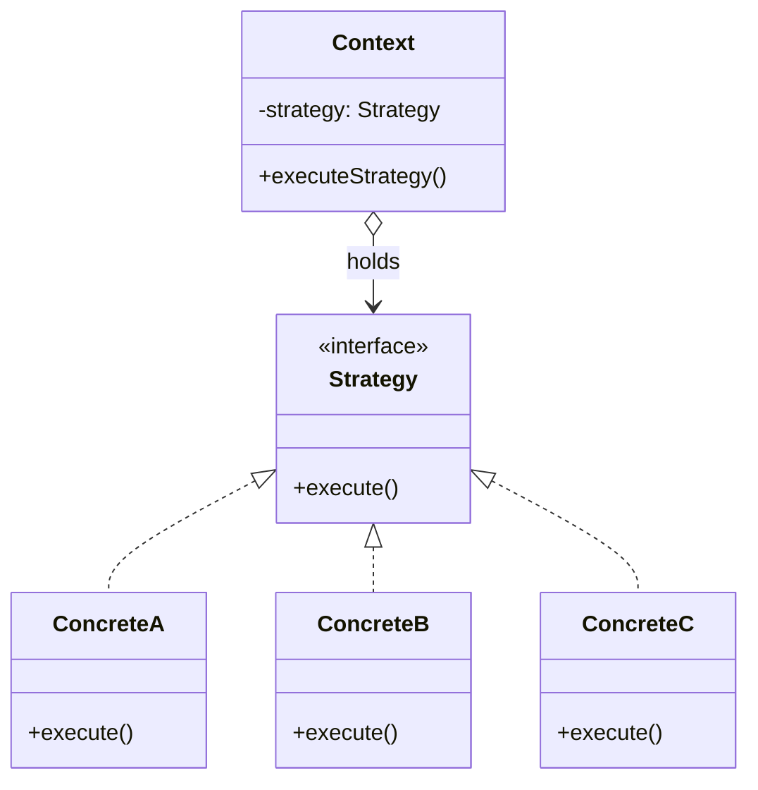
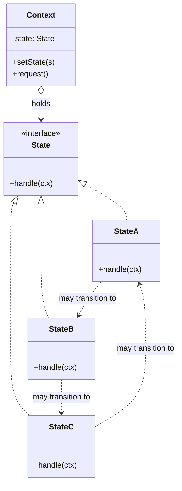
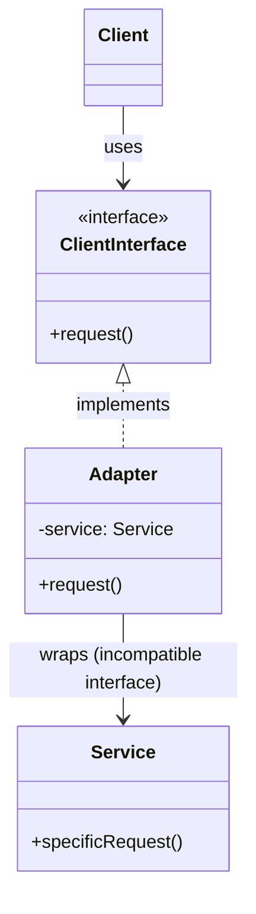
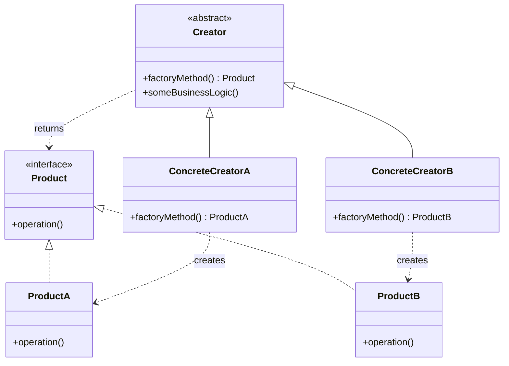
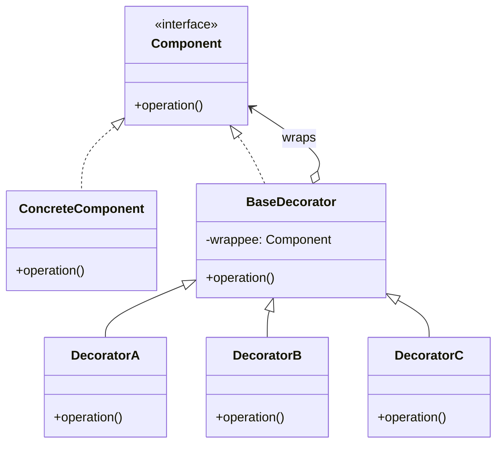

# Design Patterns — Reference (the 6 covered)

Deep dive on each pattern. Read the relevant section when SKILL.md points you here.

**Meta-rule:** Patterns are **named blueprints** for solving recurring problems. They are NOT magic incantations. Every pattern recommendation must be grounded in a real symptom (code smell). KISS overrides clever pattern usage for genuinely simple systems.

**Important:** Most modern languages with first-class functions, modules, or composition primitives can replace pattern boilerplate with simpler constructs. Recommend the pattern when the structural value is real, not just to "use a pattern."

---

## Strategy (Behavioral)

### Intent
Define a family of algorithms, encapsulate each, make them interchangeable.

### When to use
- Big switch/if-elseif on algorithm type (`if mode == "fast" elseif mode == "thorough" ...`).
- Multiple classes differ only in one swappable behavior.
- Need to swap algorithm at runtime.
- Adding new algorithm shouldn't require editing the consuming class (OCP).

### When NOT to use
- Few stable variants → just use a conditional. KISS.
- Language has first-class functions → pass a function instead of building a class.
- Behavior maintains state and transitions → use **State** instead.

### Structure

Context delegates to the strategy via the interface. Client picks concrete strategy and injects it.

### Pros
- Swap algorithms at runtime.
- Isolate algorithm details from consumers.
- Replace inheritance with composition.
- **Enables OCP**: new strategies without changing the context.

### Cons
- Overkill for few stable algorithms.
- Clients must understand the strategies to choose correctly.
- Modern languages can use first-class functions instead of class hierarchies.

### Distinguishing from related patterns
- **vs State**: Strategy variants are independent of each other; State variants may know each other and trigger transitions.
- **vs Decorator**: "Decorator changes the **skin**, Strategy changes the **guts**."
- **vs Command**: Command captures an operation as an object (for queueing/undo); Strategy varies how the same conceptual operation is performed.

---

## State (Behavioral)

### Intent
Let an object alter its behavior when its internal state changes — appears as if the object changed its class.

### When to use
- An object behaves differently based on a state field, AND state-specific code is large or growing.
- Many methods all `switch (status)` on the same state variable.
- State transitions are themselves non-trivial and changing.
- A class is "polluted with massive conditionals" (the canonical motivation).

### When NOT to use
- 2-3 stable states with simple per-state behavior → conditionals are fine. KISS.
- States are pure data without behavior differences → just use enum/field.

### Structure

Concrete states may know each other and trigger transitions. Context delegates state-specific work to the active state. To transition: replace the state object.

### Pros
- **SRP**: state-related code organized into separate classes.
- **OCP**: introduce new states without changing existing state classes or context.
- Eliminates bulky state machine conditionals.

### Cons
- Overkill if few states or rarely changing.

### Strategy vs State (the practical distinction)
| Aspect | Strategy | State |
|--------|----------|-------|
| Purpose | Swap algorithms doing the *same thing* differently | Change behavior based on internal state |
| Knowledge | Strategies are independent | States may know each other and trigger transitions |
| Who chooses | Client picks | Often self-determined via transitions |
| Transitions | Rarely | Core to the pattern |

State is essentially Strategy where the strategies can replace themselves on the context.

---

## Adapter (Structural) — also "Wrapper"

### Intent
Allow objects with incompatible interfaces to collaborate.

### When to use
- Integrating a 3rd-party / legacy / external class with an interface that doesn't fit your code.
- Migrating from one API/SDK to another while keeping client code stable.
- Bridging between paradigms (callback-style ↔ promise-style, sync ↔ async).
- Wrapping a class you can't modify to expose your code's expected interface.

### When NOT to use
- You control both sides — just refactor one to match.
- Translation is so simple it's a one-liner — don't make a class for it.

### Structure (object adapter — composition)

Adapter implements the interface the client expects, wraps the incompatible service, and translates calls.

### Pros
- **SRP**: separates conversion logic from primary business logic.
- **OCP**: new adapter types don't break existing client code.

### Cons
- Adds a class layer; sometimes simpler to change the service to match.

### Distinguishing from related patterns
- **vs Decorator**: Adapter changes the interface; Decorator preserves/extends the interface and supports recursive composition.
- **vs Proxy**: Both wrap; Proxy keeps the same interface, Adapter changes it.
- **vs Facade**: Facade defines a *new* interface for an entire subsystem; Adapter wraps one object to make its existing interface usable.

### Red flags suggesting Adapter
- Caller massages data before/after every call to a class.
- Wrapper functions everywhere ("my version of `lib.foo`").
- Type mismatches between architectural layers.

---

## Factory Method (Creational) — also "Virtual Constructor"

### Intent
Provide an interface for creating objects in a superclass, but let subclasses alter the type of objects created.

### When to use
- Don't know beforehand the exact types your code should work with.
- Library/framework needs users to provide custom variants (override the factory method).
- Want to centralize creation logic for caching, pooling, or instrumentation.
- Conditional `new` calls based on configuration are scattered through the code.

### When NOT to use
- Only one product type → just use the constructor. Factory Method is overkill.
- "Products" don't share a meaningful common interface.
- Modern languages with first-class types/functions can often replace the boilerplate.

### Structure

**Important:** Product creation is NOT the creator's primary responsibility. The creator usually has business logic that *uses* products; the factory method decouples that logic from concrete product classes.

### Pros
- Avoids tight coupling between creator and concrete products.
- **SRP**: product creation in one place.
- **OCP**: new product types without breaking existing client code.
- Constructor must always return new objects; factory method can return cached/pooled instances.

### Cons
- More complexity (subclasses for each product variant).

### Evolution
Designs often start with **Factory Method** (simple) and evolve toward **Abstract Factory**, **Prototype**, or **Builder** (more flexibility, more complexity).

---

## Decorator (Structural) — also "Wrapper"

### Intent
Attach new behaviors to objects by placing them inside special wrapper objects that contain the behaviors.

### When to use
- Need to combine multiple optional behaviors (caching + logging + retry around a call).
- Want runtime composition of features (config-driven enable/disable).
- Avoiding combinatorial subclass explosion (`EmailAndSMSAndSlackNotifier`).
- The class to extend is `final`/sealed.

### When NOT to use
- One or two stable behaviors → just use composition directly without the pattern.
- Order-sensitive stacking would confuse the team.
- Need to find/remove specific decorators in the stack frequently (Decorator is bad at this).
- The framework provides middleware/interceptor primitives that already cover this.

### Structure

Stack at runtime: `DecoratorA(DecoratorB(DecoratorC(ConcreteComponent)))`. Each decorator implements the same interface, so the stack is treated as a single Component. Each concrete decorator adds behavior before/after the wrappee call.

### Pros
- Extend behavior without subclassing.
- Add/remove responsibilities at runtime.
- Combine behaviors by stacking.
- **SRP**: split monolithic class into focused wrappers.

### Cons
- Hard to remove a specific wrapper from the stack.
- Hard to write decorators whose behavior doesn't depend on stack order.
- Initial layer-configuration code can look ugly.

### Distinguishing from related patterns
- **vs Adapter**: Decorator preserves/extends the interface; Adapter changes it.
- **vs Strategy**: "Decorator changes the **skin**, Strategy changes the **guts**."
- **vs Proxy**: Decorator's composition is controlled by the client; Proxy usually manages the wrapped object's lifecycle itself.
- **vs Chain of Responsibility**: Similar structure, but CoR can stop the chain; Decorator can't break the flow.
- **vs Composite**: Composite has many children and "sums up"; Decorator has one child and adds behavior.

### Real-world examples
- HTTP middleware stacks (Express, ASP.NET, Rack).
- Caching/retry/logging wrappers around a repository.
- Java I/O streams (`BufferedInputStream(FileInputStream(...))`).

---

## Singleton (Creational) — USE WITH STRONG CAUTION

### Intent
Ensure a class has only one instance and provide a global access point to it.

### Solves two problems at once (and Refactoring.Guru notes this **violates SRP**)
1. Ensure single instance.
2. Provide global access.

### When to use
- A genuine system-wide single point (e.g., logger configuration, feature flag registry at app boundary).
- Resource pools where the pool itself is conceptually singular (DB connection pool — though even here prefer DI).

### When NOT to use (most cases)
- **Anywhere DI can be used instead** — the modern recommendation.
- For "shared state" — usually a code smell.
- For configuration — pass it explicitly.
- In testable code — Singletons make isolated unit testing painful.

### Mechanism
1. Make constructor private.
2. Add a static `getInstance()` that creates-if-null, returns cached.
3. Replace all `new SingletonClass()` calls with `SingletonClass.getInstance()`.
4. Handle thread safety (double-checked locking or eager init).

### Pros
- Guarantees single instance.
- Global access.
- Lazy initialization.

### Cons (the article itself flags many)
- **Violates SRP** (solves two problems).
- **Masks bad design** — components knowing too much about each other.
- **Hard to unit test** — private constructor + static methods resist mocking.
- Multithreading complications.
- Hides dependencies (consumers don't declare what they depend on).
- Tightly couples consumers to the singleton's API.
- Resists substitution → conflicts with DIP.

### From Refactoring.Guru itself (verbatim)
> "It may be difficult to unit test the client code of the Singleton... Or just don't write the tests. Or don't use the Singleton pattern."

### The modern recommendation
Use **dependency injection** to provide a single shared instance to consumers, scoped by a DI container or composition root. You get singleton-ness without the global-access pollution.

### Red flags suggesting Singleton is the WRONG tool
- Reaching for it because "easier than passing it around."
- Tests need to reset singleton state between runs.
- Multiple "singletons" each managing some "configuration."
- Want to swap implementation but can't.

---

## Pattern selection cheatsheet

| Symptom | Likely pattern |
|---------|----------------|
| `if/elseif` on algorithm type | **Strategy** |
| `switch (status)` repeated across many methods | **State** |
| Incompatible 3rd-party interface | **Adapter** |
| Conditional construction (`if config then new A() else new B()`) scattered | **Factory Method** |
| Combinatorial subclass explosion for optional features | **Decorator** |
| "We need exactly one" + considering global access | **Stop. Try DI first.** Singleton if no alternative. |

---

## What's NOT in this skill

The 6 patterns covered are: Strategy, State, Adapter, Factory Method, Decorator, Singleton.

Other patterns the agent might want to look up elsewhere (Refactoring.Guru, GoF book):
- **Creational**: Abstract Factory, Builder, Prototype.
- **Structural**: Bridge, Composite, Facade, Flyweight, Proxy.
- **Behavioral**: Chain of Responsibility, Command, Iterator, Mediator, Memento, Observer, Template Method, Visitor.

If a problem clearly maps to one of these (e.g., "many configuration knobs to assemble an object" → Builder), recommend it but acknowledge the skill doesn't cover it in depth.
