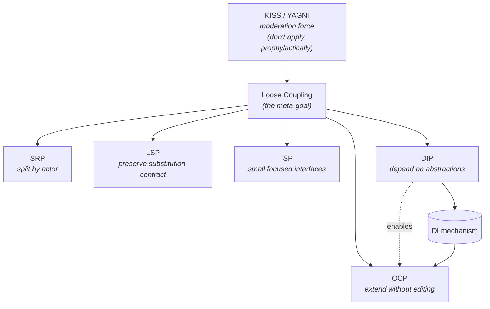

# SOLID Principles — Reference

Deep dive on each SOLID principle. Read the relevant section when SKILL.md points you here.

**The meta-goal:** All five SOLID principles serve **loose coupling** and **manageable change**. They are not religious laws — they are heuristics for "where to invest in flexibility."

---

## S — Single Responsibility Principle (SRP)

### Definition
> A class/module should have **one and only one reason to change**.

Better phrasing (from Brains-to-Bytes):
> A class should be responsible for **one and only one actor** (stakeholder group).

### Core insight
SRP is **about people, not code**. Different stakeholder groups (finance, operations, engineering) drive different changes. When their concerns share one class, a fix for one group silently breaks behavior used by another.

### When to apply
- A class has methods serving clearly different stakeholders.
- Bug fixes for one stakeholder break behavior used by another.
- The class name needs an "And" (`UserAndOrderManager`).
- A shared private helper feels strained because it serves divergent needs.

### When NOT to apply
- Splitting purely on "feels different" without identifying distinct actors.
- Tiny classes that exist only because *some* hypothetical actor *might* request changes (YAGNI).

### Red flags
- Same private helper called by methods that change for different external reasons.
- Methods clustered in one class that change on totally unrelated schedules.
- Touching one method requires re-testing unrelated methods.

### Important: SRP ≠ "do one thing well"
Those are different principles at different levels:
- **"Do one thing well"** = function-level rule.
- **SRP** = module/class-level rule about **change drivers**.

### Important: SRP can override DRY
If the same code serves two different actors, **leave it duplicated**. The two copies will evolve in different directions. DRY'ing them creates a wrong abstraction that breaks both stakeholders.

### Canonical example
A `Warehouse` class with:
- `calculate_total_assets` (finance dept)
- `need_additional_stock?` (warehouse manager)
- `save_inventory_records` (engineering dept)

→ Split into `AssetCalculator`, `StockManager`, `InventoryRepository`. They may share a `WarehouseFacade` that delegates.

---

## O — Open/Closed Principle (OCP)

### Definition (Bertrand Meyer, 1988)
> Software entities should be **open for extension** but **closed for modification**.

Meyer's two original definitions:
- **Open** = "still available for extension" (can add new fields/functions).
- **Closed** = "available for use by other modules" with a stable interface.

### Core insight
**Most design patterns exist to enable OCP.** When the agent recognizes an OCP violation, the right question is "**which pattern enables this extension?**" — not "should I add a pattern at all?"

### When to apply
- About to add a new variant of something (payment type, storage backend, formatter).
- About to edit a class to add a similar feature you've added before.
- See an `if/elseif` chain on a type code.

### When NOT to apply
- Speculative future flexibility (no evidence of variation pressure).
- Combinatorial subclass blowup looms — switch to composition (Decorator/Strategy) instead.

### Red flags
- `if type == "X" elseif type == "Y" elseif type == "Z"` (suggests Strategy/State).
- Editing the same well-tested class repeatedly to add similar features.
- Combinatorial subclass naming (`ReportDbEnglish`, `ReportFileEnglish`, `ReportDbSpanish`, ...).
- Comments like `// add new payment type here`.

### Important caveat
> "It's impossible to make a completely closed program. What you can choose is **what to close and what to leave open**." — Brains-to-Bytes

OCP is about **strategic** flexibility investment, not blanket abstraction.

### Canonical mechanism
1. Identify the changing aspect (storage method, payment type, etc.).
2. Extract it behind an interface.
3. Concrete variants implement the interface.
4. Consumer depends on the interface (DIP) — accepts new variants without modification.

This is essentially the **Strategy pattern** in disguise.

---

## L — Liskov Substitution Principle (LSP)

### Definition (Barbara Liskov, 1987)
> A subtype must be substitutable for its base type **without altering correctness** of programs using the base type.

Plain English:
> Code that depends on type T should work correctly with any subtype S of T.

### Core insight
**LSP is about semantic consistency, not just interface conformance.** Implementing the same methods isn't enough — the **behavioral contract** (preconditions, postconditions, invariants) must hold.

### When to apply
- About to introduce inheritance.
- A subclass overrides parent methods with stricter constraints or different return types.
- Designing microservices that share a REST contract.

### When NOT to apply
- LSP doesn't trigger if you avoid inheritance (composition-only codebases).
- Don't refuse all inheritance; do refuse inheritance that breaks substitutability.

### Red flags
- Subclass override that returns a different type (collection vs. scalar).
- Subclass that throws "not supported" or no-ops on inherited methods.
- Caller code with `if obj instanceof SubtypeX` branching (the "tempting wrong fix").
- Subclass with stronger preconditions (refuses inputs the parent accepts).
- Subclass with weaker postconditions (returns less than parent promised).

### Canonical violation
**Square inherits Rectangle.** Mathematically `square is-a rectangle`, but in code:
- Rectangle: `setWidth(4); setHeight(5); area() == 20`
- Square: `setWidth(4); setHeight(5); area() == 25` (height set both dimensions)

Code that worked for Rectangle now breaks for Square. **Fix:** make Square and Rectangle siblings under a `Shape` interface, not parent/child.

### Modern context
LSP is the **least daily-applicable** of SOLID for codebases that prefer composition over inheritance. But when inheritance IS used, LSP violations are insidious — they pass type checkers silently.

---

## I — Interface Segregation Principle (ISP)

### Definition
> Clients should not be forced to depend on **interfaces / methods they don't use**.

### Core insight
**ISP is "SRP for interfaces."** Big monolithic interfaces force every client to know about every method. Small, role-specific interfaces let clients depend only on what they need.

### When to apply
- An interface has many methods, where most implementations only need a few.
- Adding a method to an interface forces unrelated implementations to add stubs.
- A class fattens to accommodate behaviors that aren't conceptually related.
- Inheritance is being misused to graft unrelated capability onto a hierarchy (e.g., making `Robot` inherit `Alarm` so it can be registered as a notifier).

### When NOT to apply
- Don't split cohesive interfaces just for purity (a `Reader` with `read()`/`peek()`/`close()` is fine — those methods belong together).
- Don't create one interface per method.

### Red flags
- `NotImplementedException` / "not supported" / no-op overrides.
- Mock objects requiring stubs of many methods irrelevant to the test.
- Interface name joining concerns (`UserAndPermissionManager`).
- Adding a single method requires changes across many implementations.

### Canonical example
A 3D shape needs `area()` and `volume()`. A 2D shape needs only `area()`. Don't stuff both into one `ShapeInterface`. Split: `ShapeInterface { area() }` + `ThreeDimensionalShape { volume() }`. 3D shapes implement both.

---

## D — Dependency Inversion Principle (DIP)

### Definition
> High-level modules should not depend on low-level modules. **Both should depend on abstractions.** Abstractions should not depend on details; details should depend on abstractions.

### Core insight
**Depend on things that change less often than you do.** Concrete classes are unstable (new constructor args, renamed methods). Interfaces are stable (they describe what, not how). Coupling to abstractions = protection against churn in implementations.

### Mechanism: Dependency Injection (DI)
DIP is the principle. **DI is the mechanism**:
- **Constructor injection** (preferred): pass dependency in the constructor.
- **Setter injection**: provide via setter method (for optional or runtime-swappable deps).

DI doesn't require a framework. Manual DI is fine and often preferable.

### When to apply
- A class instantiates concrete dependencies via `new`/`make`.
- The class can't be unit-tested in isolation because it builds its own infrastructure.
- The same logic needs to work with multiple implementations (DB types, payment gateways, notifiers).
- You expect implementations to change.

### When NOT to apply
- For stable ubiquitous types: don't wrap `String`, `List`, simple value objects.
- Throwaway scripts.
- Performance-critical hot paths where indirection is costly.

### Red flags
- Constructor body contains `new ConcreteX()` for a dependency.
- Tests require real DBs, networks, or filesystems.
- Logger-style globals reaching into business logic ("singleton statics").
- Code reads "manager.databaseConnection.execute(sql)" — long chains traversing concretes.

### Practical exception
**Logging routinely violates DIP** in real codebases (loggers are wired everywhere via globals/statics). This is widely accepted — it's the canonical pragmatic exception.

### Canonical mechanism
```
// BAD: depends on concrete
class Robot {
    Robot() { this.antenna = new Antenna(7); }
}

// GOOD: depends on interface, injected
class Robot {
    Robot(MessageSender sender) { this.sender = sender; }
}
interface MessageSender { sendInformation(msg) }
class Antenna implements MessageSender { ... }
class InverterWire implements MessageSender { ... }
```

Now `Robot` works with any `MessageSender`. Test by injecting a mock.

---

## How the five interact



- **SRP** is the most universally applied (community consensus).
- **DIP + DI** is the mechanism for OCP and loose coupling.
- **OCP** is the design goal; most patterns achieve it.
- **LSP** constrains how inheritance can satisfy OCP.
- **ISP** is SRP applied to interfaces; supports DIP by keeping abstractions focused.
